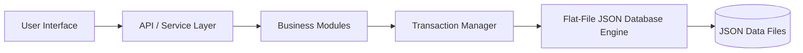

# 🚀 Enterprise Resource Planning (ERP) Ecosystem

[](https://opensource.org/licenses/MIT)
[]()
[]()

A modern, modular Enterprise Resource Planning platform designed for flexibility, portability, and low operational overhead. This project aims to deliver a self-contained ERP ecosystem that can run with minimal infrastructure while remaining extensible for growing organizations.

The foundation is built around a lightweight, transaction-safe flat-file JSON storage model that enables rapid deployment, simple maintenance, and easy local testing without the complexity of a traditional database stack.

---

## 🎯 Project Vision

This ERP ecosystem is intended to provide a practical alternative to heavyweight enterprise platforms by combining:

- Modular business domains such as finance, inventory, procurement, sales, and human resources
- A clean and extensible architecture for future scaling
- Low dependency deployment for edge environments, startups, and internal tools
- Strong auditability, data consistency, and maintainability

---

## 🧩 Core Design Principles

- Modular architecture: each business domain is isolated and independently extendable
- Lightweight data layer: JSON-based persistence with atomic write patterns
- Transaction safety: reliable update flows for critical operations
- Developer-friendly: simple setup, clear structure, and easy onboarding
- Cloud-ready: designed to be deployable to GitHub, Docker, containers, or modern hosting platforms

---

## 🏗️ System Architecture

The system is organized as a layered architecture where business modules communicate through a central application layer and persist data through a dedicated storage engine.



### Architecture Highlights

- Presentation layer: web-based client experience
- Application layer: API services and business logic orchestration
- Domain modules: finance, inventory, CRM, HR, procurement, reporting
- Persistence layer: structured JSON storage with safe write operations
- Integration layer: future support for APIs, events, and external connectors

---

## 🧠 Proposed Module Structure

The ERP ecosystem is planned around the following business domains:

- Finance & Accounting
- Inventory & Warehouse Management
- Sales & Customer Relationship Management
- Procurement & Supplier Management
- Human Resources & Payroll
- Reporting & Analytics

Each module will be designed to operate independently while sharing common infrastructure such as authentication, audit logging, permissions, and data validation.

---

## 🛠️ Technology Stack

The project is being designed with a modern, maintainable stack that balances simplicity and scalability.

| Layer | Recommended Technology |
|---|---|
| Frontend | React, TypeScript, Tailwind CSS |
| Backend | Node.js with Express or Fastify |
| API Style | REST API with optional WebSocket support |
| Data Storage | Flat-file JSON database with atomic write handling |
| Authentication | JWT-based auth with role-based access control |
| Validation | Zod or Joi |
| Testing | Vitest, Jest, Playwright |
| Packaging | Docker, GitHub Actions |
| Version Control | Git and GitHub |

> The stack above reflects the intended implementation direction and can evolve as the project matures.

---

## 📁 Repository Structure

A scalable repository layout for this project may look like this:

```text
ERP/
├── apps/
│   ├── web/
│   └── api/
├── packages/
│   ├── core/
│   ├── modules/
│   └── shared/
├── data/
├── docs/
├── tests/
└── README.md
```

---

## 🚀 Getting Started

This repository is currently in the planning and design phase. The goal is to establish a solid foundation before implementation begins.

Planned next steps:

1. Define the domain model for each ERP module
2. Implement the storage engine and transaction flow
3. Build the core API layer and authentication foundation
4. Create the initial web interface and module shells
5. Add automated tests and CI/CD workflows

---

## ✅ Roadmap

### Phase 1 — Foundation
- Core architecture definition
- Storage engine design
- Shared utilities and configuration

### Phase 2 — Core Modules
- Finance and inventory modules
- Authentication and authorization
- Basic reporting and audit trail

### Phase 3 — Productization
- UI refinement
- Deployment automation
- Docker support and GitHub workflows

---

## 🤝 Contributing

Contributions are welcome as the project evolves. Suggested areas for contribution include:

- Domain modeling
- API architecture
- UI/UX design
- Testing and quality assurance
- Documentation and examples

Please open an issue or submit a pull request with a clear description of the change.

---

## 📄 License

This project is licensed under the MIT License.

---

## 🌟 Summary

This repository is positioned as a practical, modern ERP blueprint that emphasizes modularity, simplicity, and portability. It is designed to be approachable for small teams while remaining adaptable for growth.

